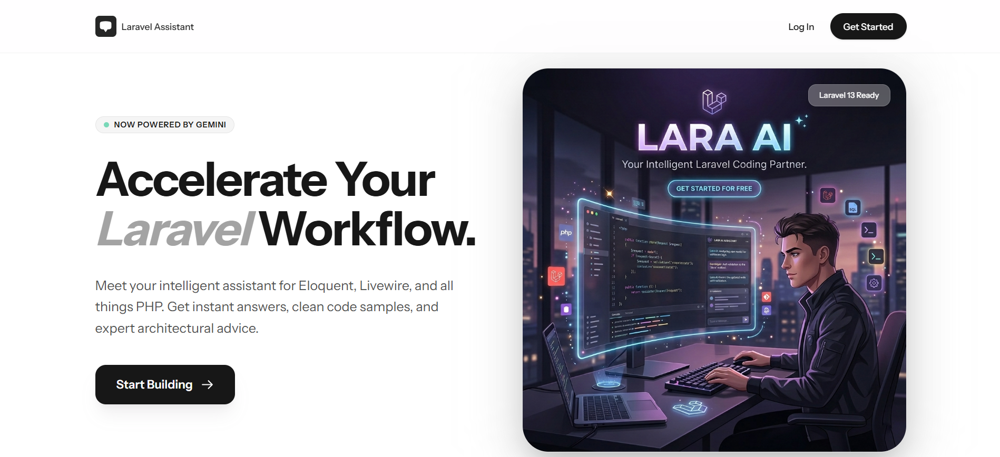

# Laravel Assistant

<p align="center">
    
</p>

**Laravel Assistant** is a AI-powered coding partner designed specifically for the Laravel ecosystem. Built with Laravel 13, Livewire, and Google's Gemini AI, it provides instant, expert-level advice on Eloquent, architectural patterns, and full-stack development with the TALL stack.

## ✨ Features

- 🤖 **AI-Powered Chat**: Intelligent coding assistance via Google Gemini.
- 🚀 **Next-Gen Tech**: Built on **Laravel 13**, **Livewire 4**, and **Flux UI**.
- 🎨 **Adaptive Design**: Fully responsive UI with seamless **Dark/Light** mode transitions.
- 🛠️ **Best Practices**: Focuses on modern PHP patterns, attributes, and clean architecture.
- 🔐 **Secure Authentication**: Robust user management powered by Laravel Fortify.
- ⚡ **Lightning Fast**: Optimized for speed and developer productivity.

## 🧰 Tech Stack

- **Framework**: [Laravel 13.x](https://laravel.com)
- **Frontend**: [Livewire 4](https://livewire.laravel.com), [Flux UI](https://fluxui.dev), [Tailwind CSS](https://tailwindcss.com)
- **AI Backend**: [Google Gemini API](https://aistudio.google.com/) via [Laravel AI SDK](https://github.com/laravel/ai)
- **Authentication**: [Laravel Fortify](https://laravel.com/docs/fortify)

## 🚀 Getting Started

### Prerequisites

- PHP 8.3+
- Composer
- Node.js & NPM
- Google Gemini API Key

### Installation

1. **Clone the repository**:
   ```bash
   git clone https://github.com/AyodhyaSankalpa/Laravel-Assistant.git
   cd ai-chatbot
   ```

2. **Install dependencies**:
   ```bash
   composer install
   npm install
   ```

3. **Configure Environment**:
   ```bash
   cp .env.example .env
   php artisan key:generate
   ```

4. **Setup Database**:
   ```bash
   # Update your .env with your database credentials
   php artisan migrate
   ```

5. **AI Configuration**:
   Ensure your `.env` contains the required keys:
   ```env
   GEMINI_API_KEY="your-gemini-api-key"
   AI_DEFAULT_PROVIDER=gemini
   ```

### Running Locally

```bash
# Start Vite build process
npm run dev

# Start Laravel server
php artisan serve
```

## 👨‍💻 Developed By

Developed with by **[Ayodhya Sankalpa](https://ayodhyasankalpa.github.io/)**.

## 📄 License

The Laravel Assistant is open-source software licensed under the [MIT license](https://opensource.org/licenses/MIT).
